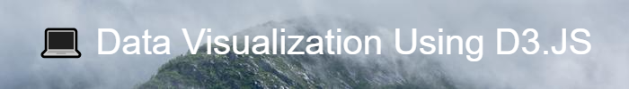

```Data Visualization Using D3.JS``` is my final year project for my Computer Science degree taken at De Montfort University.


## APIs
> Instead of using the smaller dataset from Kaggle, I've looked at a few APIs that can automatically grab the data for the visualization. Below I have listed the APIs that have caught my interest with the last link being the chosen API for the project.
- https://developer.spotify.com/documentation/web-api/ [09/03/2022 - struggle to use this]
- https://developer.spotify.com/console/get-playlist-images/ [09/03/2022 - struggle to use this]
- https://calendarific.com/api-documentation [13/03/2022 - decided not to use]
- https://www.fruityvice.com/doc/index.html [13/03/2022 - decided not to use]
- https://openlibrary.org/developers/api [13/03/2022 - decided not to use]
- http://www.penguinrandomhouse.biz/webservices/rest/ [13/03/2022 - decided not to use, but may possibly change mind]
- **https://www.thecocktaildb.com/api.php?ref=apilist.fun [13/03/2022 - chosen api]**

# **General To Do List**
- [x] Submit 1st deliverable [14/01/2022]
- [x] Update readme.md with more information + add the mockups + checklist w/ dates [02/03/2022]
- [x] Improve organization of the readme.md [02/03/2022]
- [x] Resize mockups [02/03/2022]
- [x] Find suitable public API to stick with [13/03/2022]
- [x] Brainstorm what possible charts could be made using d3.js with this API [13/03/2022]
- [x] Create a Project management Section within the GitHub readme.md [13/03/2022]
- [x] Revise the graphics + mockups folder, perhaps delete the artist images and get rid of mockups since they are outdated? [13/03/2022]
- [x] Start structuring the final deliverable report, create comments and questions where necessary [14/03/2022]
- [x] Update the test plans [18/03/2022]
- [ ] Add test plans to this readme file (currently on word document)
- [ ] Make sure to implement a variety of media screens amongst all pages


## **CSS To Do List**
- [x] Change the h1/h2/h3/h4 code to be consistent throughout every page [generally done throughout project]
- [x] Change header styles to be more attractive [generally done throughout project]
- [ ] https://www.penguinrandomhouse.com/ I like how the nav links get orange outlines once hovered!

## **index.html To Do List**
- [x] Make the nav bar stay in a fixed position (it currently moves down with you if you scroll) [02/03/2022]
- [x] Resize hero image [02/03/2022]
- [x] Interact button works [02/03/2022]
- [ ] Revise index.html information in between sections and replace information with applicable new API information
- [ ] Uncomment the menu toggler code in HTML & CSS
- [ ] Review menu toggler JS code

## **interact.html To Do List**
- [x] Create the skeleton of page [13/03/2022]
- [x] Implement the data visualization [17/03/2022]
- [ ] Add icon buttons

###  Visualization Use Cases
- [ ] View data
- [ ] Filter data
- [ ] Undo changes
- [ ] Select data
- [ ] Highlight data
- [ ] View help guide
- [ ] Restart

## **about.html To Do List**
- [x] Create the skeleton of page [18/03/2022]
- [x] Should this be revised and turned into an about page? [18/03/2022] **Answer: Yes, and add a Help section if needed**
- [ ] optional: Add help section


## Blackbox Testing
> Insert more information as mentioned in the first deliverable

## Project Management
> My project plan was originally created as an excel file with a product & sprint backlog. I've moved the tasks into the project repository to make the information easier to find and update. 

| Milestone                             | Tasks                                                                           | Completion  |
| -------------                         |:-------------:                                                                  | -----:      |
| Find and source an open database      | <li>Found Spotify dataset on Kaggle</li> <li>Made simple bar chart</li>         | 10/09/2021  |
| Populate the **index.html** page      | <li>Added nav bar</li> <li>Created different sections</li>                      | insert accurate date |
| Populate the **interact.html** page   | <li>Add go back button</li> <li>Create a section for data visualization</li>    | insert accurate date |
| Create an interactive bubble chart    | <li>Bubbles can be clicked</li>    | insert accurate date |

